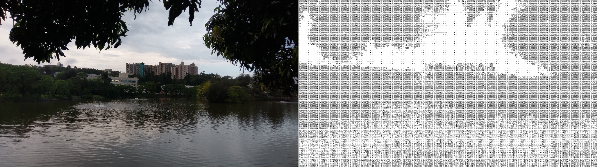

# ASCII Art Generator




## Prepare Environment

Create a conda environment:

```
conda create -n ascii_art python=3.8
conda activate ascii_art
pip install -r requirements.txt
```

## Generate ASCII Art

Generate aN ASCII Art iamge:

```
python text2image.py --path "input/cats.jpg"
```

the generated image and txt file will be saved at output/ .


Generate ASCII Art iamge in Madarin, composed of custom charactors , in dark mode, and in different resolution:
```
python text2image.py --path "input/nthu.jpg" --language "mandarin" --char "星期一清大沒有停電，交又贏" --dark --size_factor 15
```

```

                     _L        ._     y,                    
                    ,^^_       ?`"~--- L                    
                  _``  `-~,,,  ;       "                    
                  /        >r  ?        L                   
                 /`,,     *    ^<      v,                   
                ,` "L"._>"      v       "v                  
               ?`      J        "         L                 
              _         L      ~           ^*               
              F         ,       ,             ,             
             *          ",       ,            \             
            /             ;      L             "            
            L             "      "             `            
                          )       L           ,             
            \             F       `           F             
 ,,,,,,,,,,,,*r,,,,cr*~_,r,,,,,.f_`"*,,,__,,,i,,,,,,,,,,,,, 
               `"`-`>L``         ^".,_ __..r`               
                   L  L              ````                   
                   ;  |                                     
                  )` ,                                      
                  L ,`                                      
                 _  `                                       
                 "  l                                       
                  L_ * `"                                   
                   `"""*`

```
